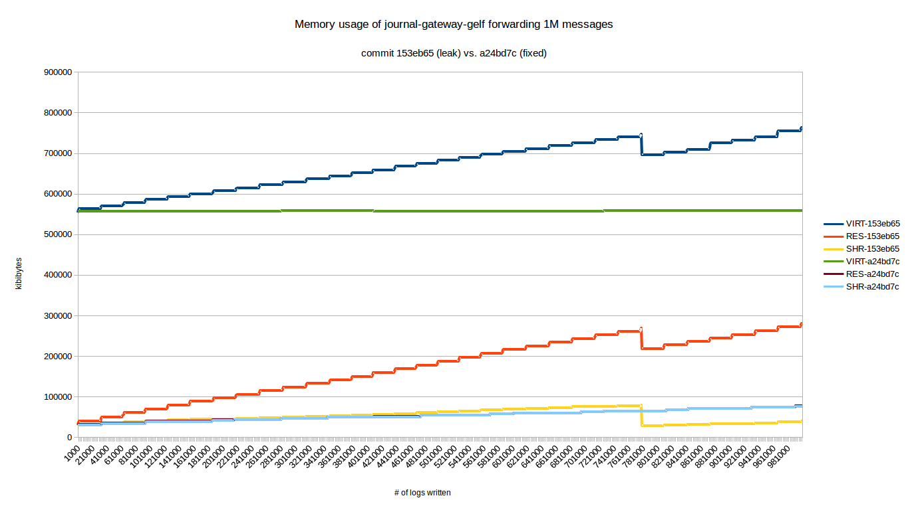
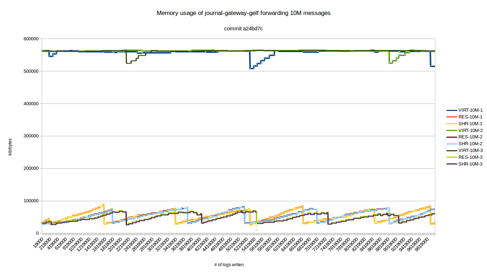

# journal-gatway-gelf memory leak tests

Several memory leaks were discovered in version 1.0.2.

The following commits should close the leaks:

* e849b06ecfd63236af3fa1cc2319a33ef957c111
* ece9977f7a3f493a8f077dd6179c445d87934e6d
* a24bd7cbb1578d83275e7b3ff559e69dafcce5b6

## Files

* [test script](test-journal-gateway-gelf.sh)
* [test data](journal-gateway-gelf_memleak_fixed.ods)
* [result graph test 1](journal-gateway-gelf_memleak_fixed_old-vs-new-1M.png)
* [result graph test 2](journal-gateway-gelf_memleak_fixed_new-10M.png)

## Test Script

To test the effect of the aforementioned commits, a (very!) simple [script](test-journal-gateway-gelf.sh) uses logger to 
create a large number of log messages which are then forwarded by 
`journal-gateway-gelf`.

## Test 1 

The first test compares the memory usage of version 1.0.2 with commit a24bd7c 
when forwarding 1 million messages.
The resulting graph shows that the memory usage of the latest commit is almost 
stable.

## Test 2

Because the first test showed just the slightest rise in memory consumption for the fixed version, 
a second test was performed by forwarding 10 million logs to Graylog2. The test was repeated two times.

## Conclusion

As one can see from the [data](journal-gateway-gelf_memleak_fixed.ods) and graphs, memory consumption of journal-gateway-gelf is stable in commit a24bd7c.
